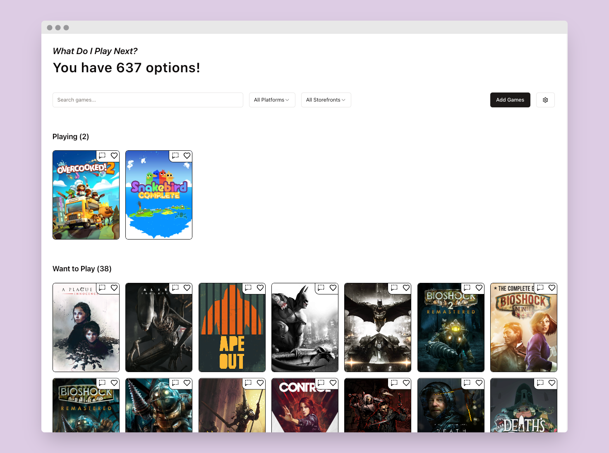

# Backlog Tracker

Barebones game tracker, supporting Steam, Epic Games, GoG, and Amazon Games.

## But why

I had too many games in my Epic Library and too much free time over Thanksgiving break.

Very heavily inspired by [Daryl Talks Games](https://www.youtube.com/watch?v=BuszSUI_qBY), who did an excellent 3-year series on the psychology of a backlog. I tried doing his process of making a spreadsheet, but it was very slow and I nerd-sniped myself into making this.

## But what about Backloggd?

Yes, yes. That's not the point. This is for managing your library, nothing else. No social features. No ranking. Just granular categorization.